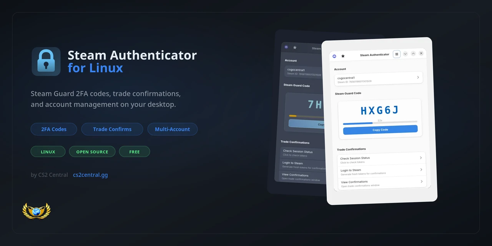
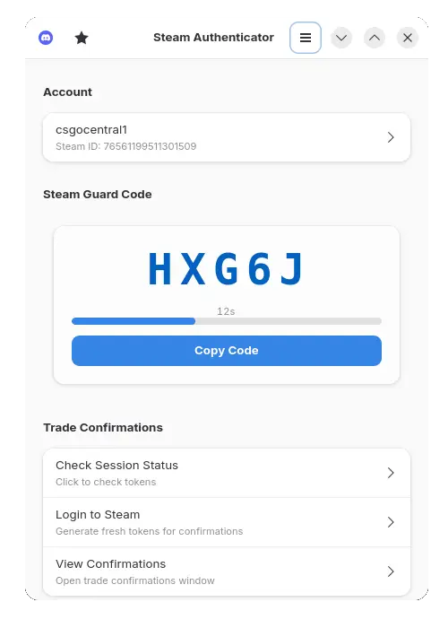
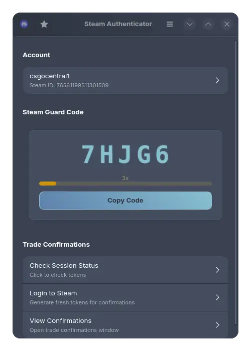

<p align="center">
  
</p>

<p align="center">
  <a href="https://discord.gg/cs2central"></a>
  <a href="https://cs2central.gg/"></a>
  <a href="https://github.com/cs2central/steam-authenticator-linux/releases"></a>
  <a href="https://github.com/cs2central/steam-authenticator-linux/blob/main/LICENSE"></a>
</p>

<p align="center">
  <a href="https://cs2central.gg/">Website</a> •
  <a href="https://discord.gg/cs2central">Discord</a> •
  <a href="#installation">Installation</a> •
  <a href="#features">Features</a>
</p>

---

## Screenshots

<p align="center">
  
  
</p>

## Features

- **2FA Code Generation** - Generate Steam Guard codes with live countdown timer
- **Trade Confirmations** - View, accept, and deny trade confirmations
- **Multiple Accounts** - Manage unlimited Steam accounts
- **8 Beautiful Themes** - Light, Dark, Crimson, Ocean, Forest, Purple, Sunset, Nord
- **Import/Export** - Import individual .maFile or entire folders
- **Backup & Restore** - Backup all accounts to a single file
- **Steam Login** - Login directly to refresh session tokens
- **Modern UI** - Built with GTK4 and libadwaita for native Linux experience

## Installation

### Quick Install (Recommended)

```bash
git clone https://github.com/cs2central/steam-authenticator-linux.git
cd steam-authenticator-linux
./install.sh
```

### Manual Installation

<details>
<summary><b>Debian / Ubuntu / Linux Mint</b></summary>

```bash
sudo apt install gir1.2-gtk-4.0 gir1.2-adw-1 libgtk-4-1 libadwaita-1-0 \
    python3-gi python3-gi-cairo python3-pip

git clone https://github.com/cs2central/steam-authenticator-linux.git
cd steam-authenticator-linux
python3 -m venv --system-site-packages venv
./venv/bin/pip install -r requirements.txt

./run.sh
```

</details>

<details>
<summary><b>Arch Linux / CachyOS / Manjaro</b></summary>

```bash
sudo pacman -S gtk4 libadwaita python python-gobject python-pip

git clone https://github.com/cs2central/steam-authenticator-linux.git
cd steam-authenticator-linux
python -m venv --system-site-packages venv
./venv/bin/pip install -r requirements.txt

./run.sh
```

**AUR:**
```bash
yay -S steam-authenticator-linux
```

</details>

<details>
<summary><b>Fedora</b></summary>

```bash
sudo dnf install gtk4 libadwaita python3 python3-gobject python3-pip

git clone https://github.com/cs2central/steam-authenticator-linux.git
cd steam-authenticator-linux
python3 -m venv --system-site-packages venv
./venv/bin/pip install -r requirements.txt

./run.sh
```

</details>

<details>
<summary><b>openSUSE</b></summary>

```bash
sudo zypper install gtk4 libadwaita-devel python3 python3-gobject python3-pip

git clone https://github.com/cs2central/steam-authenticator-linux.git
cd steam-authenticator-linux
python3 -m venv --system-site-packages venv
./venv/bin/pip install -r requirements.txt

./run.sh
```

</details>

<details>
<summary><b>Flatpak (Universal)</b></summary>

```bash
flatpak install flathub gg.cs2central.SteamAuthenticator
```

</details>

## Usage

### Importing Accounts

1. **Import Single File**: Menu → Import Account → Select your `.maFile`
2. **Import Folder**: Menu → Import Folder → Select folder containing `.maFile` files
3. **Manual Entry**: Menu → Add Account → Enter account details manually

Your `.maFile` should contain:
```json
{
  "account_name": "your_steam_username",
  "steamid": "76561198xxxxxxxxx",
  "shared_secret": "base64_encoded_secret==",
  "identity_secret": "base64_encoded_secret=="
}
```

### Managing Confirmations

1. Click on the account row to switch between accounts
2. Click "View Confirmations" to see pending trade confirmations
3. Accept or deny individual trades, or use "Accept All" / "Deny All"

### Backup & Restore

- **Backup**: Menu → Backup All Accounts → Save as .zip file
- **Restore**: Menu → Restore from Backup → Select .zip file

## Themes

Access via **Menu → Preferences → Appearance**

| Theme | Description |
|-------|-------------|
| Light | Clean bright interface |
| Dark | Standard dark mode |
| Crimson | Red neon aesthetic |
| Ocean | Blue theme |
| Forest | Green theme |
| Purple | Violet theme |
| Sunset | Orange theme |
| Nord | Nordic color scheme |

## File Locations

| Data | Location |
|------|----------|
| Account Files | `./src/maFiles/` or `~/.local/share/steam-authenticator/` |
| Preferences | `~/.config/steam-authenticator/preferences.json` |
| Logs | `./steam_authenticator.log` |

## Building from Source

```bash
git clone https://github.com/cs2central/steam-authenticator-linux.git
cd steam-authenticator-linux
./install.sh
```

## Contributing

Contributions are welcome! Please read our [Contributing Guidelines](CONTRIBUTING.md) before submitting a PR.

1. Fork the repository
2. Create your feature branch (`git checkout -b feature/amazing-feature`)
3. Commit your changes (`git commit -m 'Add amazing feature'`)
4. Push to the branch (`git push origin feature/amazing-feature`)
5. Open a Pull Request

## Security

- Your `.maFile` data is stored locally only
- No data is sent to external servers (except Steam's official API)
- All authentication happens on your machine
- Open source - verify the code yourself

## License

This project is licensed under the GPL-3.0 License - see the [LICENSE](LICENSE) file for details.

## Support

- **Discord**: [discord.gg/cs2central](https://discord.gg/cs2central)
- **Website**: [cs2central.gg](https://cs2central.gg/)
- **Issues**: [GitHub Issues](https://github.com/cs2central/steam-authenticator-linux/issues)

## Credits

- **zorex** - Lead Developer
- [CS2Central](https://cs2central.gg/) - Community
- Built with [GTK4](https://gtk.org/) and [libadwaita](https://gnome.pages.gitlab.gnome.org/libadwaita/)

---

<p align="center">
  Made with ❤️ by zorex & <a href="https://cs2central.gg/">CS2Central</a>
</p>
