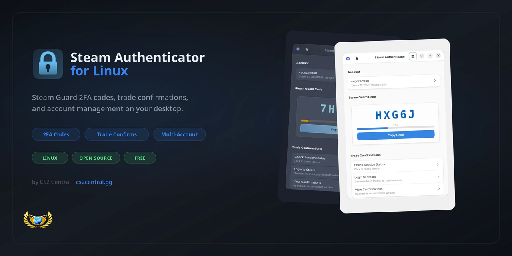
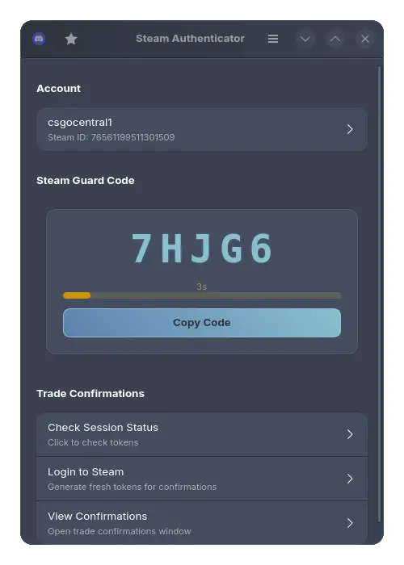
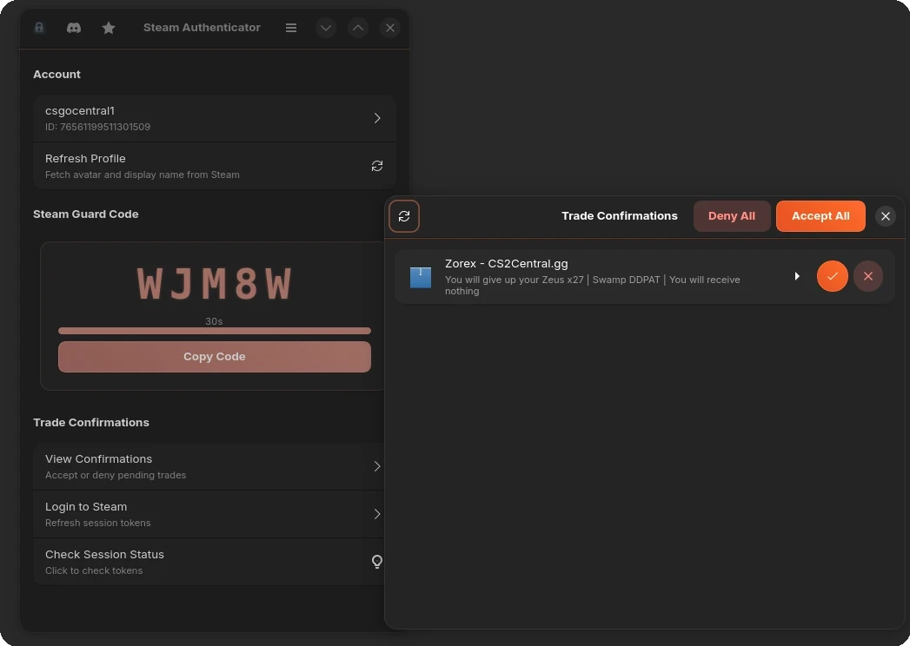

<p align="center">
  
</p>

<p align="center">
  <a href="https://discord.gg/cs2central"></a>
  <a href="https://cs2central.gg/"></a>
  <a href="https://github.com/cs2central/steam-authenticator-linux/releases"></a>
  <a href="https://github.com/cs2central/steam-authenticator-linux/blob/main/LICENSE"></a>
</p>

Steam Guard 2FA codes, trade confirmations, and account management on your Linux desktop. No phone app needed.

---

## Install

```bash
git clone https://github.com/cs2central/steam-authenticator-linux.git
cd steam-authenticator-linux
./install.sh
```

That's it. The install script handles dependencies for Debian/Ubuntu, Arch, Fedora, and openSUSE.

<details>
<summary>Manual install (if install.sh doesn't work for your distro)</summary>

**Debian / Ubuntu / Linux Mint:**
```bash
sudo apt install gir1.2-gtk-4.0 gir1.2-adw-1 libgtk-4-1 libadwaita-1-0 python3-gi python3-gi-cairo python3-pip
python3 -m venv --system-site-packages venv && ./venv/bin/pip install -r requirements.txt
./run.sh
```

**Arch / CachyOS / Manjaro:**
```bash
sudo pacman -S gtk4 libadwaita python python-gobject python-pip
python -m venv --system-site-packages venv && ./venv/bin/pip install -r requirements.txt
./run.sh
```

**Fedora:**
```bash
sudo dnf install gtk4 libadwaita python3 python3-gobject python3-pip
python3 -m venv --system-site-packages venv && ./venv/bin/pip install -r requirements.txt
./run.sh
```

</details>

## Screenshots

<p align="center">
  
  
</p>

13 themes available: Light, Dark, Crimson, Ocean, Forest, Purple, Sunset, Nord, Neon, Sakura, Hacker, Bubblegum, Minimal. Change in **Menu > Preferences > Appearance**.

## Getting Started

### New Steam account (no authenticator yet)

1. Menu > **Set Up New Account**
2. Enter your Steam username and password
3. If you have email Steam Guard, enter the code sent to your email
4. Enter the SMS verification code Steam sends to your phone
5. **Save your revocation code** (you need this to remove the authenticator later)

### Already have a .maFile

Menu > **Import Account** > select your `.maFile`. You can also import an entire folder of `.maFile` files.

### Trade confirmations

Click **View Confirmations** to see pending trades. Accept or deny individually, or use Accept All / Deny All.

### Backup

Menu > **Backup All Accounts** saves everything to a .zip. Restore with Menu > **Restore from Backup**.

## Security

- All data stored locally on your machine with restricted file permissions
- No external servers (only Steam's official API)
- Encrypted storage with AES-256-GCM
- Fully open source

## Support

- [Discord](https://discord.gg/cs2central)
- [GitHub Issues](https://github.com/cs2central/steam-authenticator-linux/issues)

## Uninstall

```bash
rm -f ~/.local/share/applications/gg.cs2central.SteamAuthenticator.desktop
rm -f ~/.local/share/icons/hicolor/256x256/apps/gg.cs2central.SteamAuthenticator.png
rm -f ~/.local/share/icons/hicolor/scalable/apps/gg.cs2central.SteamAuthenticator.svg
rm -rf /path/to/steam-authenticator-linux
rm -rf ~/.config/steam-authenticator ~/.local/share/steam-authenticator
```

## License

GPL-3.0 - see [LICENSE](LICENSE).

---

<p align="center">
  Made by zorex & <a href="https://cs2central.gg/">CS2 Central</a>
</p>
